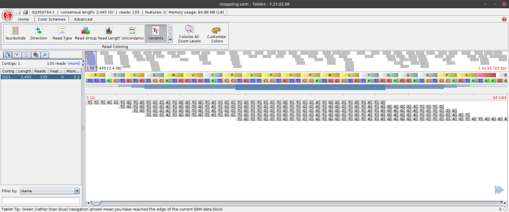

# Exam

In the exam task you will extend your mapper with a k-mer spectrum error correction algorithm in order to deal with sequencing errors in the dataset. Then, you will use your code to suggest the correct antibiotic for the treatment of four patients. 

In order to help you with this, the repository already contains a solution for last week's mapper task. Of course, I encourage you to use your own code from last week instead - I think it is much more fun to work with ones own code.

## Grading

You will get most points for the implementation. However, there are also other graded tasks:

* 5 points for identifying the correct mutations in the Tablet task
* 10 points for the suggested antibiotics based on the mapping without error correction (2.5 points per patient)
* 10 points for the suggested antibiotics based on the mapping with error correction (2.5 points per patient)
* 10 points for explaining the differences (or absence thereof) between the two results

Thus, you can get up to 65 points for the implementation and up to 35 points for the theoretical part, up to a total of 100 points.

## Visualizing the mapping

First, please map the reads from [data/fluA_reads.fasta](data/fluA_reads.fasta) onto [data/fluA_reads.fasta](data/fluA.fasta) and save the result as fluA_mapping.sam. 

Then, load the mapping fluA_mapping.sam and the reference [data/fluA_reads.fasta](data/fluA.fasta) into [Tablet](https://ics.hutton.ac.uk/tablet/) (by clicking on the button "Open Assembly" on the top left). You should obtain a visualization similar to this:


This shows you a schematic overview of the entire reference with the reads mapped to it on the top, underneath you can see a detailed view: First the whole reference sequence translated into amino acids, underneath the nucleotide sequence of the reference, and then the reads.

If you hover your mouse over a read, you get some information about that read. Additionally, the coordinate axis between the reference and the reads shows the position of the base you are hovering over as a red number. In this example, you can see that the first base "T" in the read "Read_95" was mapped to position 10 of the reference sequence.

If you choose the option "Variants" in the "Color Schemes" tab, all read bases that are identical to the reference sequence are greyed out:



Differences to the reference sequence in the entire mapping are visualized in the overview as red stripes. Please mind that, since there are more bases in the reference than there are pixel columns on the screen, not all differences might be visible here!

### Tablet task

Please write down in the following quote block which mutations you can find in the mapping, using the format `<reference base><position><new base>` (e.g. `T10A` would mean that the reference has a "T" at position 10, but you think that the reads suggest that there is an "A" at that position in the sequenced genome):

```
Mutation 1:
Mutation 2:
...
Mutation n:
```

## Antibiotica resistances

Recognizing such mutations is especially important when diagnosing bacterial infections. Bacteria can develop resistances against antibiotics - prescribing such an antibiotic will then not heal the patient. However, many mutations that cause the development of antibiotic resistances are already known. Accordingly, sequencing and analysing the genome of a bacterium before deciding which antibiotic to prescribe to a patient can allow prescribing an antibiotic against which the bacterium has no resistances.

Staphylococcus aureus is an especially prominent example of this, since it is able to accumulate antibiotic resistances quickly. Infections with multiresistant S. aureus (MRSA) pose a major challenge in medicine, since in the worst case none of the available antibiotics might work against the infection (or the only antibiotics that still work might be so-called "drugs of last resort" - antibiotics that are held back for especially critical cases in order to avoid exposing bacteria to evolutionary pressure that might allow them to develop resistances against this last line of defence).

In this task, you will analyze sequences of the rpoB gene from samples from four patients infected with S. aureus. The following antibiotics are available for treatment, with their priority indicated in braces after the name. To treat a patient, the antibiotic with the highest priority that the bacterium has no resistance against should be used:

* Daptomycin (1)
* Rifampicin (2)

Additionally, the following mutations are known that confer resistances:

* C1862A: Resistance against Daptomycin
* T2858G: Resistance against Daptomycin
* C1402A: Resistance against Rifampicin

Please map the read sequences of the 4 patients ([data/patient1.fasta](data/patient1.fasta) - [data/patient4.fasta](data/patient4.fasta)) onto the rpoB reference ([data/rpoB.fasta](data/rpoB.fasta)) and look at the mapping results. Then, write down in the blockquote below which mutations relevant to antibiotics resistances you have been able to identify and which antibiotic you would recommend for each of the patients based on those results:

```text
Person 1 - Mutation(s): <YOUR MUTATIONS>, Recommendation: <YOUR RECOMMENDED ANTIBIOTIC> 
Person 2 - Mutation(s): <YOUR MUTATIONS>, Recommendation: <YOUR RECOMMENDED ANTIBIOTIC> 
Person 3 - Mutation(s): <YOUR MUTATIONS>, Recommendation: <YOUR RECOMMENDED ANTIBIOTIC> 
Person 4 - Mutation(s): <YOUR MUTATIONS>, Recommendation: <YOUR RECOMMENDED ANTIBIOTIC> 
```

Do not let yourself be confused by differences to the reference sequence that occur only in single reads - this is a real dataset and the reads contain sequencing errors.

## Error correction

As you might have noticed during the analysis in the task above, those real sequencing reads contain sequencing errors. Such sequencing errors can make the analysis harder or lead to misinterpretation of the data.

One way of correcting errors in reads prior to the analysis is based on the k-mer spectrum. This method assumes that, due to a high sequencing coverage, every k-mer from the genome should be present multiple times since it should be covered by multiple reads. If a k-mer appears much fewer times in the dataset than the other k-mers, it is most likely due to a sequencing error (since, instead of being present in all reads covering the respective part of the genome, it is present only in the erroneous read).

For instance, let's take a look at a short genome sequenced without sequencing errors and the corresponding 3-mer spectrum:


In this case, the genome has been fully covered by 5 error-free reads, and the resulting k-mers have frequencies of 2, 4, 4, and 2.

If, however, one of the reads contains an error (in this case, the 3rd base of read 2 is read as C instead of T), the spectrum changes:


Due to the error, three new k-mers appear in the dataset, and each of those only has a frequency of 1.

Based on this information, the erroneous k-mers can be corrected. First, a frequency cutoff has to be defined, so that all k-mers occurring at a frequency lower than that cutoff are assumed to be erroneous. For each such k-mer, the following steps are performed:

* For each base X in the k-mer:
  * For each possible base Y (A, G, T and C):
    * Generate a candidate k-mer by exchanging the base X with the base Y
    * If that candidate k-mer also occurs in the dataset, and its frequency is higher than the cutoff: Remember that candidate as a possible correction for the erroneous k-mer
* If a candidates were found: Replace that k-mer with the candidate that occurs in the dataset at the highest frequency. If multiple candidates exist that have the same frequency, choose one at random.

In order to perform a mapping using a dataset corrected in this way, the correctable k-mers identified in this way need to be replaced by their correct versions in the reads.

### Implementation

Implement the k-mer spectrum error correction as follows:

First, implement a class `ReadPolisher` with the following methods:
* `__init__(self, kmerlen)`: Constructor that takes the k-mer length to be used in the error correction as sole argument
* ```add_read(self, readseq)```: Adds the k-mers from `readseq` to the k-mer spectrum
* `get_replacements(self, minfreq)`: Calculates the possible corrections for the k-mers from the spectrum that occur less often than `minfreq` and returns the results as a dictionary. The keys of that dictionary are the k-mers that can be corrected, the values are the corrections. In the above example, with minfreq=2 a key-value pair in that dictionary would be "GCT":"GTT", meaning that the k-mer GCT should be corrected to "GTT"
  
Additionally, please extend the class `Read` by a method `replace_kmers(self, replacements)`. This method should take the dictionary returned by `get_replacements` and replace all key k-mers from that dictionary with the respective values from the dictionary in the read sequence. While this is not the most efficient way (it would be more efficient to remember in `ReadPolisher` which reads the k-mer actually occurs in) it is the simplest approach.

### Application

Use your read correction to map the read sequences of the four patients ([data/patient1.fasta](data/patient1.fasta) - [data/patient4.fasta](data/patient4.fasta)) to the rpoB reference ([data/rpoB.fasta](data/rpoB.fasta)) again. Can you see a difference between mapping with and without error correction? Which k-mer lengths and which cutoffs seem to make sense?

Please enter in the blockquote below which mutations you can identify now, after error correction, and which antibiotics you would recommend now. Use the parameters that seem to make sense to you, but definitely try a k-mer length of 15 and a frequency cutoff of 3 for [data/patient2.fasta](data/patient2.fasta):

```text
Person 1 - Mutation(s): <YOUR MUTATIONS>, Recommendation: <YOUR RECOMMENDED ANTIBIOTIC> 
Person 2 - Mutation(s): <YOUR MUTATIONS>, Recommendation: <YOUR RECOMMENDED ANTIBIOTIC> 
Person 3 - Mutation(s): <YOUR MUTATIONS>, Recommendation: <YOUR RECOMMENDED ANTIBIOTIC> 
Person 4 - Mutation(s): <YOUR MUTATIONS>, Recommendation: <YOUR RECOMMENDED ANTIBIOTIC> 
```

Can you see a difference between your recommendations now and those you gave after analysing the mapping without prior error correction? Please describe shortly (4-5 sentences should be sufficient) either where the differences come from (if you see any) or why there is no difference (if you don't see a difference):

```text
The difference...
```