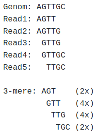

# Exam

In the exam task you will extend your mapper with a k-mer spectrum error correction algorithm in order to deal with sequencing errors in the dataset. Then, you will use your code to suggest the correct antibiotic for the treatment of four patients. 

In order to help you with this, the repository already contains a solution for last week's mapper task. Of course, I encourage you to use your own code from last week instead - I think it is much more fun to work with ones own code.

## Grading

You will get most points for the implementation. However, there are also other graded tasks:

* 5 points for identifying the correct mutations in the Tablet task
* 10 points for the suggested antibiotics based on the mapping without error correction (2.5 points per patient)
* 10 points for the suggested antibiotics based on the mapping with error correction (2.5 points per patient)
* 10 points for explaining the differences (or absence thereof) between the two results

Thus, you can get up to 65 points for the implementation and up to 35 points for the theoretical part, up to a total of 100 points.

## Visualizing the mapping

First, please map the reads from [data/fluA_reads.fasta](data/fluA_reads.fasta) onto [data/fluA_reads.fasta](data/fluA.fasta) and save the result as fluA_mapping.sam. 

Then, load the mapping fluA_mapping.sam and the reference [data/fluA_reads.fasta](data/fluA.fasta) into [Tablet](https://ics.hutton.ac.uk/tablet/) (by clicking on the button "Open Assembly" on the top left). You should obtain a visualization similar to this:


This shows you a schematic overview of the entire reference with the reads mapped to it on the top, underneath you can see a detailed view: First the whole reference sequence translated into amino acids, underneath the nucleotide sequence of the reference, and then the reads.

If you hover your mouse over a read, you get some information about that read. Additionally, the coordinate axis between the reference and the reads shows the position of the base you are hovering over as a red number. In this example, you can see that the first base "T" in the read "Read_95" was mapped to position 10 of the reference sequence.

If you choose the option "Variants" in the "Color Schemes" tab, all read bases that are identical to the reference sequence are greyed out:


Differences to the reference sequence in the entire mapping are visualized in the overview as red stripes. Please mind that, since there are more bases in the reference than there are pixel columns on the screen, not all differences might be visible here!

### Tablet task

Please write down in the following quote block which mutations you can find in the mapping, using the format `<reference base><position><new base>` (e.g. `T10A` would mean that the reference has a "T" at position 10, but you think that the reads suggest that there is an "A" at that position in the sequenced genome):

```
Mutation 1:
Mutation 2:
...
Mutation n:
```

## Antibiotica resistances

Recognizing such mutations is especially important when diagnosing bacterial infections. Bacteria can develop resistances against antibiotics - prescribing such an antibiotic will then not heal the patient. However, many mutations that cause the development of antibiotic resistances are already known. Accordingly, sequencing and analysing the genome of a bacterium before deciding which antibiotic to prescribe to a patient can allow prescribing an antibiotic against which the bacterium has no resistances.

Staphylococcus aureus is an especially prominent example of this, since it is able to accumulate antibiotic resistances quickly. Infections with multiresistant S. aureus (MRSA) pose a major challenge in medicine, since in the worst case none of the available antibiotics might work against the infection (or the only antibiotics that still work might be so-called "drugs of last resort" - antibiotics that are held back for especially critical cases in order to avoid exposing bacteria to evolutionary pressure that might allow them to develop resistances against this last line of defence).

In this task, you will analyze sequences of the rpoB gene from samples from four patients infected with S. aureus. The following antibiotics are available for treatment, with their priority indicated in braces after the name. To treat a patient, the antibiotic with the highest priority that the bacterium has no resistance against should be used:

* Daptomycin (1)
* Rifampicin (2)

Additionally, the following mutations are known that confer resistances:

* C1862A: Resistance against Daptomycin
* T2858G: Resistance against Daptomycin
* C1402A: Resistance against Rifampicin

Mappen Sie die Read-Sequenzen der 4 Personen ([data/patient1.fasta](data/patient1.fasta) - [data/patient4.fasta](data/patient4.fasta)) auf die rpoB-Referenz ([data/rpoB.fasta](data/rpoB.fasta)) und tragen Sie hier ein, welche Mutation(en) Sie identifizieren konnten und welches Antibiotikum Sie empfehlen würden:

```text
Person 1 - Mutation(en): <IHRE MUTATIONEN>, Empfehlung: <IHRE ANTIBIOTIKUMS-EMPFEHLUNG> 
Person 2 - Mutation(en): <IHRE MUTATIONEN>, Empfehlung: <IHRE ANTIBIOTIKUMS-EMPFEHLUNG> 
Person 3 - Mutation(en): <IHRE MUTATIONEN>, Empfehlung: <IHRE ANTIBIOTIKUMS-EMPFEHLUNG> 
Person 4 - Mutation(en): <IHRE MUTATIONEN>, Empfehlung: <IHRE ANTIBIOTIKUMS-EMPFEHLUNG> 
```

Lassen Sie sich bitte von Unterschieden zur Referenzsequenz, die nur in einzelnen Reads vorkommen, nicht verwirren - das ist ein realistischer Datensatz und die Reads enthalten Sequenzierfehler.

## Fehlerkorrektur

Wie Ihnen in der Identifikation der Antibiotikaresistenzen aufgefallen sein könnte, sind die realen Reads mit Sequenzierfehlern behaftet. Diese können die Analyse erschweren oder gar zu Fehlinterpretationen der Daten führen.

Eine Möglichkeit zur Korrektur dieser Fehler ist das k-mer-Spektrum. Dabei wird davon ausgegangen, dass durch eine große Coverage mit großteils korrekten Reads jedes sequenzierte k-mer mehrmals in unterschiedlichen Reads repräsentiert sein sollte. Kommt ein k-mer deutlich seltener vor, als die anderen k-mere, ist es vermutlich nicht auf eine Mutation (die ja von mehreren Reads abgedeckt sein sollte und deren k-mer entsprechend mehrmals vorkommen sollte) sondern auf einen Sequenzierfehler zurückzuführen.

Nehmen wir als Beispiel ein kurzes Genom, welches fehlerfrei sequenziert wird, und das 3-mer-Spektrum dazu: 



In diesem Fall wurde das Genom mit 5 fehlerfreien Reads abgedeckt, es ergeben sich 4 3-mere mit den Häufigkeiten 2, 4, 4 und 2.

Enthält aber einer der Reads einen Fehler (in diesem Fall wird die 3. Base von Read 2 fehlerhafter Weise als C gelesen), verändert sich das Spektrum:


Es kommen durch den Fehler drei neue k-mere hinzu, die jeweils nur ein Mal auftreten.

Anhang dieser Information kann eine Korrektur erfolgen: Es wird ein Schwellenwert definiert, ab dem ein k-mer als potenziell fehelrhaft eingestuft wird. Für jedes k-mer, welches seltener als dieser Schwellenwert vorkommt, werden folgende Schritte durchlaufen:

* Für jede Base X aus dem k-mer:
    * Für jede mögliche Base Y (A, G, T und C):
        * Generiere ein Kandidaten-k-mer indem die Base X durch die Base Y ersetzt wird
        * Falls das Kandidaten-k-mer auch im Datensatz vorkommt und zwar häufiger als der Schwellenwert: Merke es als mögliche Korrektur
* Falls Kandidaten-k-mere gefunden wurden: Ersetze das k-mer durch das Kandidaten-k-mer welches am häufigsten im Datensatz vorkommt (bei zwei Kandidaten-k-meren mit der gleichen Häufigkeit wähle zufällig eins davon)

Für das Mapping müssen die so identifizierten korrigierbaren k-mere in allen Reads ersetzt werden, in denen sie vorkommen.

### Implementation

Implementieren Sie die k-mer-Spektrum-Fehlerkorrektur wie folgt.

Implementieren Sie zunächst eine Klasse ```ReadPolisher``` mit den folgenden Methoden:
* ```__init__(self, kmerlen)```: Constructor, bekommt die zu verwendende k-mer-Länge
* ```add_read(self, readseq)```: Fügt die übergebene Readsequenz dem k-mer-Spektrum hinzu
* ```get_replacements(self, minfreq)```: Berechnet für die k-mere, die seltener als ```minfreq``` im k-mer-Spektrum vorkommen, die mögliche Korrektur und gibt ein entsprechendes dictionary zurück. Darin sind keys die korrigierbaren k-mere, values sind die Korrekturen (in dem obigen Beispiel wäre also z.B. bei minfreq=2 ein mögliches key-value-Paar "GCT":"GTT", welches aussagt, dass das k-mer "GCT" durch das k-mer "GTT" ersetzt werden soll)
  
Erweitern Sie zudem die Klasse ```Read``` um die Methode ```replace_kmers(self, replacements)```, welche die dictionary aus ```get_replacements``` bekommt und alle darin als key vorkommenden k-mere, die in dem Read vorhanden sind, durch den jeweiligen value ersetzt. Das ist zwar nicht die effizienteste Variante (effizienter wäre es, sich in ```ReadPolisher``` die Information zu merken, in welchen Reads welche k-mere vorkommen und dann nur dort die Ersetzungen vorzunehmen), aber das würde die Abschlussaufgabe zu lang machen.

### Anwendung

Verwenden Sie Ihre Read-Korrektur, um nochmal die Read-Sequenzen der 4 Personen ([data/patient1.fasta](data/patient1.fasta) - [data/patient4.fasta](data/patient4.fasta)) auf die rpoB-Referenz ([data/rpoB.fasta](data/rpoB.fasta)) zu mappen. Sehen Sie einen Unterschied? Welche k-mer-Längen und cutoffs erscheinen Ihnen sinnvoll? 

Tragen Sie hier ein, welche Mutation(en) Sie identifizieren konnten und welches Antibiotikum Sie nun empfehlen würden (verwenden Sie die Parameter, die Sie am sinnvollsten finden, probieren Sie aber zumindest ein Mal bei [data/patient2.fasta](data/patient2.fasta) eine k-mer-Länge von 15 und einen frequency cutoff von 3 aus):

```text
Person 1 - Mutation(en): <IHRE MUTATIONEN>, Empfehlung: <IHRE ANTIBIOTIKUMS-EMPFEHLUNG> 
Person 2 - Mutation(en): <IHRE MUTATIONEN>, Empfehlung: <IHRE ANTIBIOTIKUMS-EMPFEHLUNG> 
Person 3 - Mutation(en): <IHRE MUTATIONEN>, Empfehlung: <IHRE ANTIBIOTIKUMS-EMPFEHLUNG> 
Person 4 - Mutation(en): <IHRE MUTATIONEN>, Empfehlung: <IHRE ANTIBIOTIKUMS-EMPFEHLUNG> 
```

Sehen Sie einen Unterschied in den Empfehlungen zu denen, die Sie ohne Fehlerkorrektur gegeben haben? Beschreiben Sie kurz, was der Unterschied ist, und wie dieser durch die Fehlerkorrektur zustande gekommen ist (kein Roman, 5-6 Sätze reichen aus):

```text
Der Unterschied...
```